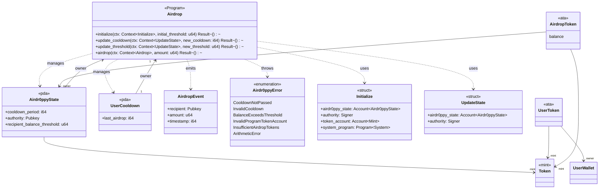

# Solana Airdrop Program Account Structure

```mermaid
classDiagram
    class Airdrop {
        <<Program>>
        +initialize(ctx: Context~Initialize~, initial_threshold: u64) Result~()~
        +update_cooldown(ctx: Context~UpdateState~, new_cooldown: i64) Result~()~
        +update_threshold(ctx: Context~UpdateState~, new_threshold: u64) Result~()~
        +airdrop(ctx: Context~Airdrop~, amount: u64) Result~()~
    }
    class Airdr0ppyState {
        <<pda>>
        +cooldown_period: i64
        +authority: Pubkey
        +recipient_balance_threshold: u64
    }
    class UserCooldown {
        +last_airdrop: i64
    }
    class AirdropEvent {
        +recipient: Pubkey
        +amount: u64
        +timestamp: i64
    }
    class Airdr0ppyError {
        <<enumeration>>
        CooldownNotPassed
        InvalidCooldown
        BalanceExceedsThreshold
        InvalidProgramTokenAccount
        InsufficientAirdropTokens
        ArithmeticError
    }
    class Initialize {
        <<struct>>
        +airdr0ppy_state: Account~Airdr0ppyState~
        +authority: Signer
        +token_account: Account~Mint~
        +system_program: Program~System~
    }
    class UpdateState {
        <<struct>>
        +airdr0ppy_state: Account~Airdr0ppyState~
        +authority: Signer
    }

    class UserCooldown {
        <<pda>>

    }

    class Token {
        <<mint>>
    }

    class UserWallet {

    }

    class UserToken {
        <<ata>>
    }

    class AirdropToken {
        <<ata>>
        balance
    }
 
    Airdrop ..> Initialize : uses
    Airdrop ..> UpdateState : uses
    Airdrop ..> Airdr0ppyState : manages
    Airdrop ..> UserCooldown : manages
    Airdrop ..> AirdropEvent : emits
    Airdrop ..> Airdr0ppyError : throws
    Airdr0ppyState --> Airdrop : owner
    UserCooldown "1" --> "1" Airdrop : owner
    Airdr0ppyState --> "mint_account" Token
    UserToken --> "owner" UserWallet
    UserToken --> "mint" Token
    AirdropToken --> "mint" Token
    AirdropToken --> "owner" Airdr0ppyState
```